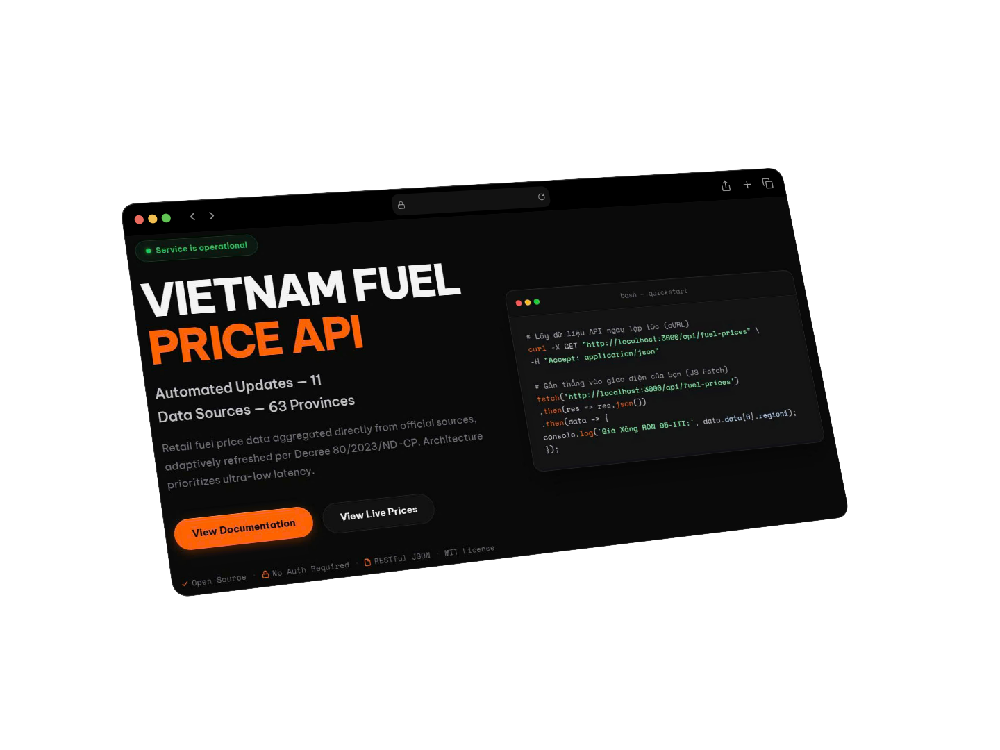
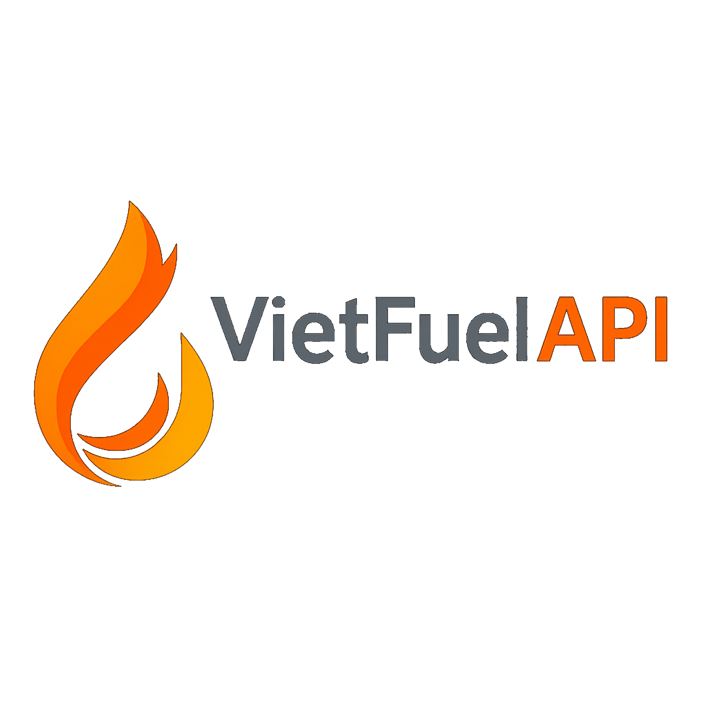

<p align="center">
  
</p>

<h1 align="center">VietFuelAPI</h1>

<p align="center">
  <strong>Real-time Vietnam Fuel Price Data — 11 Sources, 63 Provinces, Accurate Region 1 & 2 classification.</strong>
</p>

<p align="center">
  <a href="https://github.com/TranQui004/vietfuel-api/blob/main/LICENSE">
    
  </a>
  
  
  
  
</p>


<p align="center">
  
</p>

---

Vietnamese version: [README.md](README.md)

---

## 📖 Table of Contents

- [Introduction](#-introduction)
- [Key Features](#-key-features)
- [Quick Start](#-quick-start)
- [API Endpoints](#-api-endpoints)
- [Price Region Classification](#-price-region-classification)
- [Tech Stack](#-tech-stack)
- [Project Structure](#-project-structure)
- [Detailed Docs](#-detailed-docs)
- [Legal & Community](#-legal--community)
- [License](#-license)

---

## 👋 Introduction

**VietFuelAPI** is an API service providing real-time retail fuel price data for Vietnam in JSON format. Data is aggregated from **11 official sources** (including Petrolimex and Petrolimex mirrors, PVOil, Mipec, COMECO, Saigon Petro, Petro Times, WebGia, and GiaXangHomNay) and adaptively refreshed per the **Decree 80/2023** schedule.

The API supports per-province price lookup across all **63 provinces**, with accurate **Region 1** (standard price) and **Region 2** (up to +2% surcharge) classification per current regulations.

> [!IMPORTANT]
> This is a community-driven project for learning and technical research, and does not represent any organization, enterprise, or government agency.

## ✨ Key Features

- 🚀 **Ultra-fast**: Responses from in-memory cache (RAM), < 10ms latency.
- 🔄 **Auto-Sync**: Smart Adaptive Cron syncs precisely with the government's price adjustment cycle.
- 🔗 **11 Data Sources**: Integrated with Stealth Fallback Bot technology to bypass anti-bot protections.
- 🗺️ **63 Provinces**: On-demand province-level pricing with region metadata.
- 🛡️ **Accurate Regions**: 15 full Region 2 provinces + 4 partial-region provinces correctly classified.

- 🔒 **Rate Limiting**: 60 req/min for national sources, 20 req/min for on-demand provinces.
- 🌍 **HTTP Cache-Control**: Proper `Cache-Control` + `stale-while-revalidate` headers for CDN compatibility.
- 🔑 **No Auth Required**: Open to all developers, full CORS support.

## 🚀 Quick Start

```bash
# Clone the repository
git clone https://github.com/TranQui004/vietfuel-api.git
cd vietfuel-api

# Install backend dependencies
cd backend
npm install

# Install Playwright browser (required for scraping)
npx playwright install chromium

# Start development server
npm run dev
```

Default URL: `http://localhost:3000`

Frontend pages are served on the same port:
- Home: `http://localhost:3000/`
- Live Data: `http://localhost:3000/live`

If you run from repository root:

```bash
npm --prefix backend run dev
```

### 🚀 Production Deployment (PM2)

The project includes an `ecosystem.config.js` file for [PM2](https://pm2.keymetrics.io/) deployment — the standard for running Node.js in production:

```bash
# Install PM2 globally (if not already installed)
npm install -g pm2

# Start with PM2
pm2 start ecosystem.config.js --env production

# Manage the process
pm2 status
pm2 logs vietfuel-api
pm2 restart vietfuel-api
```

## 📡 API Endpoints

### National Sources

| Method | Endpoint | Description |
| :--- | :--- | :--- |
| `GET` | `/api/fuel-prices` | **(Recommended)** Aggregated best data from available sources (Default) |
| `GET` | `/api/fuel-prices/:source` | Source-specific data by source `id` (for example: `petrolimex`, `pvoil`, `mipec`, `comeco`, `saigonpetro`, `petrotimes`, ...). Full list is returned in `availableSources` when source is invalid |

### Province-level (on-demand)

| Method | Endpoint | Description |
| :--- | :--- | :--- |
| `GET` | `/api/provinces` | Full list of 63 provinces with `id`, `slug`, `region` |
| `GET` | `/api/provinces?region=2` | Filter by region |
| `GET` | `/api/fuel-prices/province/:slug` | Per-province prices (e.g., `/api/fuel-prices/province/ha-noi`) |

### System

| Method | Endpoint | Description |
| :--- | :--- | :--- |
| `GET` | `/api/health` | Health status of all 11 data sources |
| `GET` | `/api/sources` | Full list of 11 sources with cache status (transparency for developers) |

### Sample Response

```json
{
  "success": true,
  "status": "ok",
  "meta": {
    "source": "Petrolimex",
    "priceDate": "2026-03-27",
    "priceDateDisplay": "27/03/2026",
    "cacheHit": true,
    "cacheTtlRemainingSeconds": 3480,
    "totalItems": 7
  },
  "data": [
    { "name": "Xăng RON 95-V", "region1": 24730, "region2": 25220, "unit": "VND/lít" },
    { "name": "Xăng RON 95-III", "region1": 24330, "region2": 24810, "unit": "VND/lít" }
  ]
}
```

## 🗺️ Price Region Classification

Vietnam's retail fuel prices are divided into two regions per current regulations:

| Region | Description | Provinces |
| :--- | :--- | :--- |
| **Region 1** | Near depots and transport hubs. Standard price. | 43 provinces (full) |
| **Region 2** | Remote areas, islands, mountainous regions. **Up to +2% surcharge.** | 15 provinces (full) + 4 partial |

**15 full Region 2 provinces:** Hà Giang, Cao Bằng, Bắc Kạn, Tuyên Quang, Lào Cai, Điện Biên, Lai Châu, Sơn La, Yên Bái, Lạng Sơn, Kon Tum, Gia Lai, Đắk Lắk, Đắk Nông, Lâm Đồng.

**4 partial provinces** (specific districts only are Region 2):

| Province | Region 2 Districts |
| :--- | :--- |
| Quảng Ninh | Vân Đồn, Cô Tô, Hải Hà |
| Bình Thuận | Phú Quý island |
| Bà Rịa - Vũng Tàu | Côn Đảo island |
| Kiên Giang | Phú Quốc city, Kiên Hải island |

> The API returns `partialRegion: true` and a `vung2Districts` array for these 4 provinces in `/api/provinces`.

## 🛠️ Tech Stack

- **Backend**: Node.js, Express, express-rate-limit.
- **Scraping**: Playwright (Chromium headless).
- **Cache**: node-cache (In-memory) + disk persistence.
- **Scheduler**: node-cron — 3-mode adaptive schedule aligned with **Decree 80/2023/ND-CP**:
  - Mon–Wed: Every 4 hours (Checking)
  - Thu, 14:30–16:00: Every 15 minutes (Hunting — price adjustment window)
  - Fri–Sun: Every 6 hours (Maintenance)
- **Frontend**: EJS Views and Static CSS/JS served directly by Express.
- **Logging**: Winston.

## 📁 Project Structure

```text
├── backend/
│   ├── index.js              # Express entrypoint + WebSocket + static serving
│   ├── config/
│   │   └── index.js          # Shared config (port, URLs, cron, cache TTL)
│   ├── data/
│   │   └── provinces.json    # 63 provinces dataset (slug, region, districts)
│   ├── routes/
│   │   └── fuel.js           # All REST API endpoints
│   ├── services/
│   │   ├── scrapers/         # Each file is an independent engine (Plug & Play)
│   │   │   ├── utils.js          # Shared core helpers (parse, cache, browser)
│   │   │   ├── petrolimex.js     # Petrolimex (primary source)
│   │   │   ├── pvoil.js          # PVOil — 3-tier fallback strategy
│   │   │   ├── pvoil-parser.js   # Dedicated PVOil parser
│   │   │   ├── mipec.js          # Mipec
│   │   │   ├── comeco.js         # COMECO
│   │   │   ├── saigonpetro.js    # Saigon Petro
│   │   │   ├── petrotimes.js     # Petro Times
│   │   │   ├── webgia.js         # WebGia
│   │   │   └── giaxanghomnay.js  # GiaXangHomNay
│   │   ├── scraper.js        # Index — exports all scraper functions
│   │   └── cache.js          # In-memory cache (node-cache) + disk fallback
│   ├── workers/
│   │   └── jobs.js           # Cron scheduler — runs every 1 hour
│   ├── tools/
│   │   └── debug/            # Local debug scripts (not production runtime)
│   ├── utils/
│   │   ├── logger.js         # Winston structured logger
│   │   ├── websocket.js      # WebSocket server (real-time push)
│   │   └── fuel-helpers.js   # Merge, normalize, sort helpers
│   ├── tests/
│   │   ├── scrapers/         # Smoke tests per scraper (8 files)
│   │   ├── api/              # API integration tests
│   │   ├── cache/            # Cache behavior tests
│   │   ├── run-all.js        # Full test suite runner
│   │   └── run-api.js        # API-only test runner
│   └── cache.json            # Disk-persisted fallback cache
├── frontend/
│   ├── views/                # EJS templates (served by Express)
│   │   ├── index.ejs         # Landing page
│   │   ├── live.ejs          # Live Data Dashboard
│   │   ├── endpoints.ejs     # API Reference + Demo Terminal
│   │   ├── disclaimer.ejs    # Disclaimer page
│   │   ├── privacy.ejs       # Privacy Policy
│   │   ├── terms.ejs         # Terms of Service
│   │   └── partials/         # Header, Footer, Icon components
│   ├── css/style.css         # Global stylesheet
│   ├── brand/                # Logo, banner, branding assets
│   └── js/                   # Frontend JS (lang, ui, live, playground...)
├── docs/
│   ├── assets/               # README preview images
│   ├── vi/                   # Vietnamese documentation
│   │   ├── architecture.md   # System architecture
│   │   ├── changelog.md      # Version history
│   │   ├── community/        # Contributing, conduct, security, support
│   │   ├── legal/            # Legal (disclaimer, privacy, terms)
│   │   └── guides/           # Comment conventions, internal guides
│   └── en/                   # English documentation (parallel)
└── ecosystem.config.js       # PM2 production deployment config
```

## 📚 Detailed Docs

- [System Architecture](docs/en/architecture.md)
- [Changelog History](docs/en/changelog.md)
- [Comment Convention](docs/en/guides/comment-style.md)
- [Live API Documentation](http://localhost:3000)

## 🤝 Legal & Community

- [Legal Index](docs/en/legal/README.md)
- [Contributing Guide](docs/en/community/contributing.md)
- [Code of Conduct](docs/en/community/code-of-conduct.md)
- [Security Policy](docs/en/community/security.md)
- [Support](docs/en/community/support.md)

### What should be pushed to GitHub

- Source code under `backend/`, `frontend/`, `docs/`
- Community and legal markdown files
- Production config files such as `ecosystem.config.js`

### What should not be pushed

- `node_modules/`, `logs/`, debug dumps, runtime cache
- Any credential or sensitive local configuration (`.env`)

## ⚖️ License

Distributed under the **MIT** license. See `LICENSE` for more details.

---

<p align="center">
  
</p>

<p align="center">
  Built with ❤️ by Developers for Developers.
</p>
