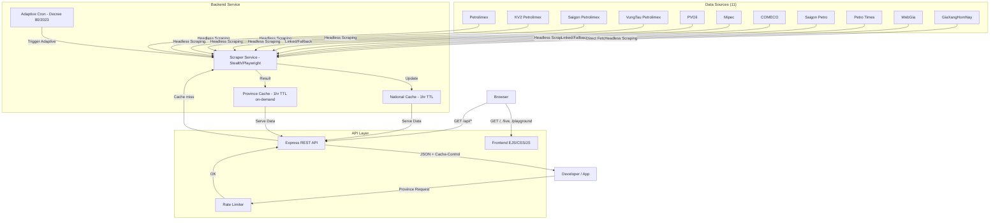

# System Architecture — VietFuelAPI

## Table of Contents

- [Overview](#overview)
- [Design Goals](#design-goals)
- [Data Flow](#data-flow)
- [Core Components](#core-components)
- [Data Quality Model](#data-quality-model)
- [Operations and Refresh Schedule](#operations-and-refresh-schedule)
- [Known Limitations](#known-limitations)
- [Design Principles](#design-principles)

## Overview

**VietFuelAPI** is built on a **Cache-First** architecture, prioritizing ultra-fast response times and resilient operation even when upstream data sources experience issues. The data collection (scraping) pipeline runs entirely separately from user-facing HTTP request handling.

The system currently integrates **11 data sources**, supports **63 provinces**, normalizes `priceDate` into **ISO 8601**, and exposes metadata signals such as `isStale` and `blockedByProtection` to keep downstream consumers informed.

> Legal note: VietFuelAPI is a community project for learning and technical research, and does not represent any organization, enterprise, or government agency.

---

## Design Goals

- **Fast response by default**: serve from cache first and keep scraping in background jobs.
- **High availability**: keep serving stale-but-marked data when a source fails.
- **Transparent metadata**: return source, scrape timestamp, cache status, and stale/protection flags.
- **Maintainable source adapters**: isolate scrapers and parsers so each source can be fixed independently when DOM changes.

---

## Data Flow

---

## Core Components

### 1. Scraper Service (`backend/services/scraper.js`)

| Source | Method | Data |
| :--- | :--- | :--- |
| Petrolimex | Playwright (popup click + fallback) | Region 1 & 2, effective date |
| KV2 Petrolimex | Playwright (mirror) | Petrolimex mirror dataset |
| Saigon Petrolimex | Playwright (mirror) | Petrolimex mirror dataset |
| VungTau Petrolimex | Playwright (mirror) | Petrolimex mirror dataset |
| PVOil | Fetch (GiaXangHomNay) | Single national price, fallback to GiaXangHomNay text to bypass Cloudflare |
| Mipec | Playwright | Region 1 & 2, date fallback from news/GXHN |
| COMECO | Linked/Fallback | Snapshot aligned with Petrolimex baseline |
| Saigon Petro | Playwright | Retail fuel pricing (not always region-split) |
| Petro Times | Linked/Fallback | Snapshot aligned with Petrolimex baseline |
| WebGia | Playwright / Fetch | Petrolimex mirror (Region 1 & 2) |
| GiaXangHomNay | Playwright | Region 1 & 2, 63 provinces on-demand |

**Date normalization**: All `priceDate` fields are normalized to **ISO 8601 (YYYY-MM-DD)**. Responses also include `priceDateDisplay` (DD/MM/YYYY) for human-readable display.

**Fallback Strategies**: Petrolimex uses GiaXangHomNay as a fallback source for effective date extraction. PVOil extracts text data via GiaXangHomNay instead of a direct headless browser to bypass strict Cloudflare protections. When direct source access is blocked, API metadata exposes `blockedByProtection: true`.

### 2. Cache Service (`backend/services/cache.js`)

| Cache | Type | TTL | Initialization |
| :--- | :--- | :--- | :--- |
| `memCache` (national) | In-memory (node-cache) | 0 (Never expires) | Bootstrap + Cron |
| `provinceCache` | In-memory (node-cache) | 0 (Never expires) | On-demand |
| Disk persistence | `cache.json` | Survives restart | Written after every update |

**Stale Cache Fallback**: Rather than deleting data when the TTL naturally expires (60 minutes), the system preserves expired cache data indefinitely (`stdTTL: 0`). If the scraping task fails or the vendor site goes down, the API falls back to serving the old data but explicitly sets the `isStale: true` flag in the metadata response. This state is visually surfaced to end users in the Live Tracker.

### 3. Routes & API Quality (`backend/routes/fuel.js`)

**Rate Limiting**:
- **National sources**: 60 req/min/IP
- **Province endpoints**: 20 req/min/IP (scraping-intensive)

**HTTP Cache-Control headers**:
- National sources: `Cache-Control: public, max-age=3600, stale-while-revalidate=60`
- Province (cache hit): `Cache-Control: public, max-age=<ttl_remaining>`
- Province (cache miss / errors): `Cache-Control: no-store`
- Province list: `Cache-Control: public, max-age=86400` (static, 24hr)

**PROVINCES data**:
- 63 provinces with `id` (2-digit string, e.g. `"01"`), `name`, `slug`, `region`
- 4 partial provinces include `partialRegion: true`, `vung2Districts[]`, `note`

### 4. Frontend UI (`frontend/`)

- **Homepage**: `frontend/views/index.ejs`.
- **Live Data**: `frontend/views/live.ejs`.
- **Playground**: `frontend/views/playground.ejs`.
- **API Reference**: `frontend/views/endpoints.ejs`.

Frontend pages are served by Express from the same runtime process and port as the API.

---

## Data Quality Model

- **Date normalization**: all `priceDate` values are normalized to `YYYY-MM-DD`.
- **Human-friendly display date**: `priceDateDisplay` is returned as `DD/MM/YYYY`.
- **Stale-state signaling**: stale responses include `isStale: true`.
- **Protection-state signaling**: PVOil fallback path may include `blockedByProtection: true`.

---

## Operations and Refresh Schedule

- **Bootstrap run**: jobs execute at startup to warm cache.
- **Adaptive cron**:
    - Monday to Wednesday: every 4 hours.
    - Thursday high-impact window: every 15 minutes.
    - Friday to Sunday: every 6 hours.
- **Petrolimex mirrors**: KV2/SAIGON/VUNGTAU are synchronized from the primary Petrolimex source.

---

## Known Limitations

- Some source websites may change DOM structure without notice, requiring parser updates.
- Strong anti-bot protections (for example Cloudflare) can force fallback usage or temporary stale serving.
- Province endpoint is on-demand, so first requests may be slower than cache hits.

---

## Design Principles

| Principle | Technical Detail |
| :--- | :--- |
| **Cache-First** | Requests are served from RAM first; scrapers run in background jobs. |
| **Resilience** | Source failures do not break API availability; stale data is still served with explicit flags. |
| **No Source Spam** | Adaptive scraping frequency follows fuel adjustment windows. |
| **Metadata Transparency** | Responses include source attribution, scrape time, TTL, and stale/protection signals. |
| **Infrastructure Friendly** | Explicit `Cache-Control` headers improve CDN and proxy behavior. |

---

## Appendix — Region Classification

| Classification | Count | Notes |
| :--- | :--- | :--- |
| Region 1 (full province) | 43 | Standard price |
| Region 2 (full province) | 15 | Up to +2% surcharge |
| Partial (mixed region) | 4 (QN, BT, BR-VT, KG) | Specific districts only are Region 2 |
