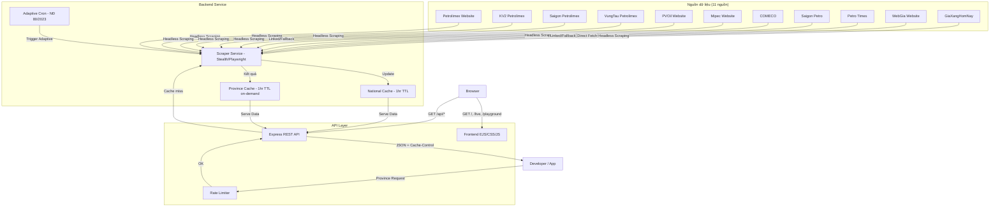

# Kiến trúc hệ thống — VietFuelAPI

## Mục lục

- [Tổng quan](#tổng-quan)
- [Mục tiêu thiết kế](#mục-tiêu-thiết-kế)
- [Luồng dữ liệu (Data Flow)](#luồng-dữ-liệu-data-flow)
- [Các thành phần cốt lõi](#các-thành-phần-cốt-lõi)
- [Mô hình chất lượng dữ liệu](#mô-hình-chất-lượng-dữ-liệu)
- [Vận hành và lịch cập nhật](#vận-hành-và-lịch-cập-nhật)
- [Giới hạn đã biết](#giới-hạn-đã-biết)
- [Nguyên tắc thiết kế](#nguyên-tắc-thiết-kế)

## Tổng quan

**VietFuelAPI** được xây dựng theo mô hình **Cache-First**, ưu tiên tốc độ phản hồi nhanh và độ ổn định ngay cả khi nguồn dữ liệu gốc gặp sự cố. Luồng thu thập dữ liệu (scraping) được tách khỏi luồng xử lý HTTP request để giảm ảnh hưởng tới người dùng cuối.

Hệ thống hiện tích hợp **11 nguồn dữ liệu**, hỗ trợ tra cứu theo **63 tỉnh/thành**, chuẩn hóa ngày theo **ISO 8601**, và bổ sung metadata để cảnh báo tình trạng dữ liệu (ví dụ: `isStale`, `blockedByProtection`).

> Lưu ý pháp lý: VietFuelAPI là dự án cộng đồng phục vụ học tập và nghiên cứu kỹ thuật, không đại diện cho bất kỳ tổ chức, doanh nghiệp hoặc cơ quan nhà nước nào.

---

## Mục tiêu thiết kế

- **Ưu tiên tốc độ phản hồi**: phục vụ từ cache trước, scraping chạy nền.
- **Ưu tiên tính sẵn sàng**: khi nguồn lỗi vẫn trả dữ liệu cũ có gắn cờ trạng thái.
- **Ưu tiên minh bạch dữ liệu**: response cung cấp metadata nguồn, thời gian cào và trạng thái cache.
- **Ưu tiên bảo trì lâu dài**: tách parser/scraper theo từng nguồn để dễ sửa khi DOM thay đổi.

---

## Luồng dữ liệu (Data Flow)

---

## Các thành phần cốt lõi

### 1. Scraper Service (`backend/services/scraper.js`)

| Nguồn | Phương thức | Dữ liệu |
| :--- | :--- | :--- |
| Petrolimex | Playwright (popup click) | Vùng 1 & Vùng 2, ngày niêm yết |
| KV2 Petrolimex | Playwright (mirror) | Mirror Petrolimex |
| Saigon Petrolimex | Playwright (mirror) | Mirror Petrolimex |
| VungTau Petrolimex | Playwright (mirror) | Mirror Petrolimex |
| PVOil | Fetch (GiaXangHomNay) | Giá thống nhất (không phân vùng), fallback lấy từ GiaXangHomNay do Cloudflare chặn |
| Mipec | Playwright | Vùng 1 & Vùng 2, fallback ngày từ news/GXHN |
| COMECO | Linked/Fallback | Snapshot liên kết chuẩn Petrolimex |
| Saigon Petro | Playwright | Giá xăng dầu bán lẻ (không luôn tách vùng) |
| Petro Times | Linked/Fallback | Snapshot liên kết chuẩn Petrolimex |
| WebGia | Playwright / Fetch | Mirror Petrolimex (Vùng 1 & 2) |
| GiaXangHomNay | Playwright | Vùng 1 & Vùng 2, 63 tỉnh thành on-demand |

**Ngày niêm yết**: Tất cả `priceDate` được chuẩn hoá về **ISO 8601 (YYYY-MM-DD)**. Response bổ sung `priceDateDisplay` (DD/MM/YYYY) cho hiển thị.

**Fallback Cào Dữ Liệu**: Petrolimex sử dụng GiaXangHomNay làm nguồn dự phòng cho ngày niêm yết. PVOil trích xuất dữ liệu thông qua văn bản (text) từ trang trung gian GiaXangHomNay để vượt rào Cloudflare. Khi nguồn trực tiếp bị chặn, API trả thêm metadata `blockedByProtection: true`.

### 2. Cache Service (`backend/services/cache.js`)

| Cache | Loại | TTL | Khởi tạo |
| :--- | :--- | :--- | :--- |
| `memCache` (national) | In-memory (node-cache) | 0 (Không hết hạn) | Bootstrap + Cron |
| `provinceCache` | In-memory (node-cache) | 0 (Không hết hạn) | On-demand |
| Disk persistence | `cache.json` | Persist qua restart | Ghi sau mỗi lần cập nhật |

**Stale Cache Fallback**: Thay vì tự động xóa Cache khi TTL vượt mức quy định (60 phút), hệ thống sẽ vô hiệu hóa tự động xóa (stdTTL = 0) và giữ lại dữ liệu cũ nhất có thể cung cấp. Nếu Crawler gặp sự cố, API vẫn sẽ trả về dữ liệu cũ nhưng chèn thêm cờ `isStale: true` để cảnh báo hệ thống hoặc người dùng (được phản ánh trên Live Tracker dưới dạng text warning).

### 3. Routes & API Quality (`backend/routes/fuel.js`)

**Rate Limiting**:
- **National sources**: 60 req/phút/IP
- **Province endpoints**: 20 req/phút/IP (scraping nặng)

**HTTP Cache-Control headers**:
- National sources: `Cache-Control: public, max-age=3600, stale-while-revalidate=60`
- Province (cache hit): `Cache-Control: public, max-age=<ttl_remaining>`
- Province (cache miss / errors): `Cache-Control: no-store`
- Province list: `Cache-Control: public, max-age=86400` (static data, 24hr)

**Danh sách tỉnh thành (PROVINCES)**:
- 63 tỉnh với `id` (chuẩn 2 chữ số, string), `name`, `slug`, `region`
- 4 tỉnh bán phần có thêm `partialRegion: true`, `vung2Districts[]`, `note`

### 4. Giao diện người dùng (`frontend/`)

- **Trang chủ**: `frontend/views/index.ejs`.
- **Live Data**: `frontend/views/live.ejs`.
- **Playground**: `frontend/views/playground.ejs`.
- **API Reference**: `frontend/views/endpoints.ejs`.

Frontend được serve trực tiếp bởi Express trong `backend/index.js` trên cùng cổng với API.

---

## Mô hình chất lượng dữ liệu

- **Chuẩn hóa ngày**: `priceDate` luôn được normalize về `YYYY-MM-DD`.
- **Hiển thị thân thiện**: thêm `priceDateDisplay` dạng `DD/MM/YYYY` cho UI.
- **Cảnh báo stale**: khi dữ liệu quá tuổi TTL, response có `isStale: true`.
- **Cảnh báo bảo vệ nguồn**: với PVOIL, khi bị chặn anti-bot sẽ có `blockedByProtection: true` nếu lấy qua fallback.

---

## Vận hành và lịch cập nhật

- **Bootstrap**: khi khởi động server, jobs được gọi ngay để làm ấm cache.
- **Adaptive Cron**:
    - Thứ 2–4: mỗi 4 giờ.
    - Thứ 5 khung điều chỉnh: mỗi 15 phút trong giờ cao điểm.
    - Thứ 6–CN: mỗi 6 giờ.
- **Mirror Petrolimex**: KV2/SAIGON/VUNGTAU đồng bộ từ nguồn Petrolimex chính.

---

## Giới hạn đã biết

- Một số nguồn có thể thay đổi DOM đột ngột, cần cập nhật parser tương ứng.
- Nguồn có chống bot mạnh (ví dụ Cloudflare) có thể buộc fallback hoặc trả stale tạm thời.
- Dữ liệu tỉnh là on-demand nên lần gọi đầu có thể chậm hơn cache hit.

---

## Nguyên tắc thiết kế

| Nguyên tắc | Mô tả kỹ thuật |
| :--- | :--- |
| **Cache-First** | Mọi request ưu tiên phục vụ từ RAM; scraper chạy nền. |
| **Khả năng phục hồi** | Lỗi nguồn không làm sập API; dữ liệu cũ vẫn phục vụ với cờ cảnh báo. |
| **Không spam nguồn** | Lịch cào thích ứng theo từng giai đoạn điều hành giá. |
| **Minh bạch metadata** | Trả về nguồn dữ liệu, thời điểm cào, TTL và trạng thái stale/protection. |
| **Thân thiện hạ tầng** | Header `Cache-Control` rõ ràng để CDN/proxy hoạt động hiệu quả. |

---

## Phụ lục — Phân vùng giá (Region Classification)

| Phân loại | Số tỉnh | Ghi chú |
| :--- | :--- | :--- |
| Vùng 1 toàn tỉnh | 43 | Giá tiêu chuẩn |
| Vùng 2 toàn tỉnh | 15 | Tối đa +2% |
| Bán phần (partial) | 4 (QN, BT, BR-VT, KG) | Một số huyện/đảo thuộc Vùng 2 |
